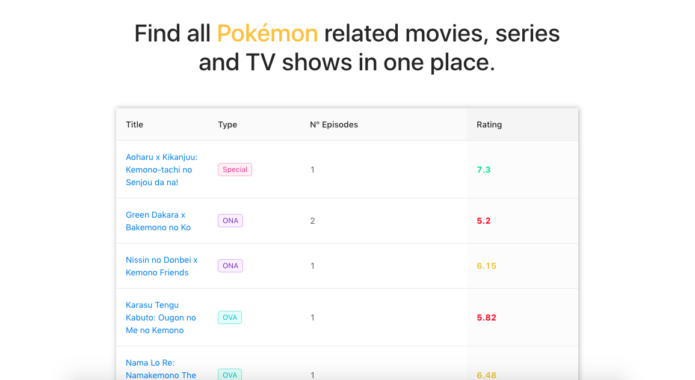

## Table

You can access a showcase of this app right here: https://elastic-dijkstra-10159e.netlify.com/

#### Tools

- Components: Ant Design
- Grid system: Bootstrap
- API: https://jikan.moe/
- Routes: React Router

#### Techniques

- BEM Syntax (Block Element Modifier)

#### Maintainability

According to code climate this code has regular (not as bad as I expected) maintainability:

#### Possible improvements

- Add possibility to sort results by rating.
- Add some filters (ex. serch by tag or by name).
- Redesign description page.
- Cover app with e2e/unit tests.
- Description page is no longer accessible after refresh. It's possible to use Redux instead of passing props directly to router link in order to fix this issue.
* Process edge cases such as empty title/too long titles, no data about number of episodes, etc.

